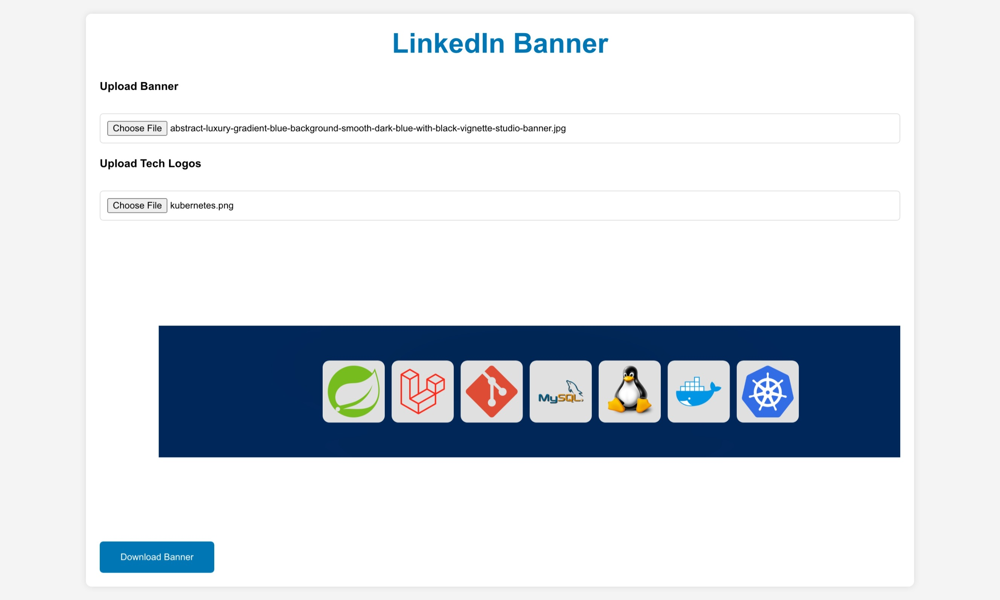

# LinkedIn Banner Generator 🌆

Generate custom LinkedIn banners with a line of logos of your most-used technologies. Ensure your profile stands out with a banner that represents the tools you work with.

  
*Sample banner generated with LinkedIn Banner Generator*

## Features 🚀

- **Upload a Custom Background**: Use your favorite backdrop image as the banner's foundation.
- **Tech Logos**: Add a line of tech logos to showcase the tools you frequently use.
- **Spacer for Profile Picture**: Don't let your profile picture cover up important content. Our banners include a spacer.
- **Download Ready**: Once you're happy with the design, download your banner with a single click!

## Getting Started 🛠

### Installation

1. Clone the repo
```bash
git clone https://github.com/RafaelXokito/linkedin-banner-generator.git
```

2. Install NPM packages
```bash
bun install
```

3. Start the development server
```bash
bun start
```

The application should now be running on `http://localhost:3000/`.

## Usage 💡

1. **Upload a Banner Background**: Click on "Upload Banner" and select your desired background image.
2. **Add Tech Logos**: Click on "Upload Tech Logos" and select the logos you want to showcase. You can select multiple logos at once.
3. **Preview**: Check out the live preview to see how your LinkedIn banner will look.
4. **Download**: Click on "Download Banner" to get your custom banner!

## Contributing 🤝

Contributions, issues, and feature requests are welcome! Start by forking the repository, create your branch from `master`, and then submit a pull request.

## License 📄

This project is licensed under the MIT License.

## Acknowledgements 🙏

- Special thanks to all the open-source packages used in this project.
- Inspirations and references.
